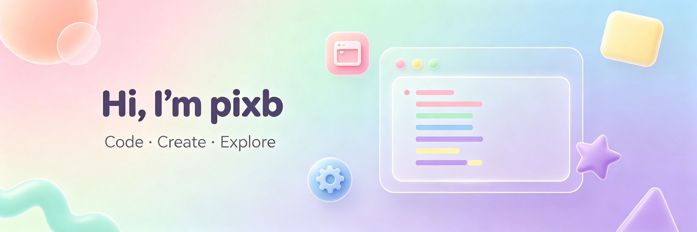

<!--
============================================================================
  pixb · GitHub Profile README
  配色：马卡龙高明度低饱和（Macaron Pastel）
  使用说明：
    1. 本仓库名必须与你的 GitHub 用户名一致（pixb/pixb），README 才会显示在主页
    2. banner.png 已放在仓库根目录，如需更换直接替换同名文件即可
    3. 所有 "pixb" 用户名、邮箱、技术栈图标均可按需修改
    4. 贪吃蛇动画需配合 .github/workflows/snake.yml 使用（已包含）
    5. 统计卡片使用 shields.io（稳定）+ github-readme-stats（增强，公共实例偶发 503 可自托管）
============================================================================
-->

<!-- ========== 顶部横幅 ========== -->

  

<!-- ========== 打字机效果 ========== -->

  

 

<!-- ========== 关于我 ========== -->
## 🌸 About Me

> "Code is poetry written for machines, read by humans."

- 🎯 &nbsp;Passionate about building things that live on the internet
- 🤖 &nbsp;Interested in AI / ML and creative coding tools
- 🌱 &nbsp;Always learning, always building, always curious
- 💡 &nbsp;Love turning complex problems into elegant solutions
- 🤝 &nbsp;Happy to collaborate on interesting open-source projects
- 📫 &nbsp;Reach me at: **tpxsky@163.com**

 

<!-- ========== 技术栈 ========== -->
## 🛠️ Tech Stack

<!-- 可在 https://skillicons.dev 查看全部可用图标，按需增删 -->

  

 

<!-- ========== GitHub 统计 ========== -->
## 📊 GitHub Stats

<!-- shields.io 徽章组：稳定可靠，全球均可访问 -->

  
  &nbsp;
  
  &nbsp;
  

<!-- github-readme-stats 卡片：公共实例偶发 503，如长期无法加载可自托管
     自托管教程：https://github.com/anuraghazra/github-readme-stats#deploy-on-own-vercel-instance -->

  
  &nbsp;
  

<!-- 连续提交天数：streak-stats 已迁移到 demolab.com，稳定可用 -->

  

 

<!-- ========== 贡献贪吃蛇 ========== -->
## 🐍 Contribution Snake

<!-- 首次使用需在仓库 Settings → Actions → General 中勾选 "Read and write permissions"，
     然后手动触发一次 snake.yml workflow，output 分支生成后此处自动显示 -->

  <picture>
    <source media="(prefers-color-scheme: dark)" srcset="https://github.com/pixb/pixb/blob/output/github-contribution-grid-snake-dark.svg" />
    <source media="(prefers-color-scheme: light)" srcset="https://github.com/pixb/pixb/blob/output/github-contribution-grid-snake.svg" />
    
  </picture>

 

<!-- ========== 联系我 ========== -->
## 📫 Connect With Me

  
  &nbsp;
  

<!-- 如有博客、Twitter、LinkedIn、Bilibili 等，可在此处添加对应徽章（取消注释并修改链接）

  
  &nbsp;
  

-->

 
 

<!-- ========== 页脚 ========== -->

  
   
   
  <i>✨ Thanks for stopping by! Have a wonderful day! ✨</i>
   
   
  

